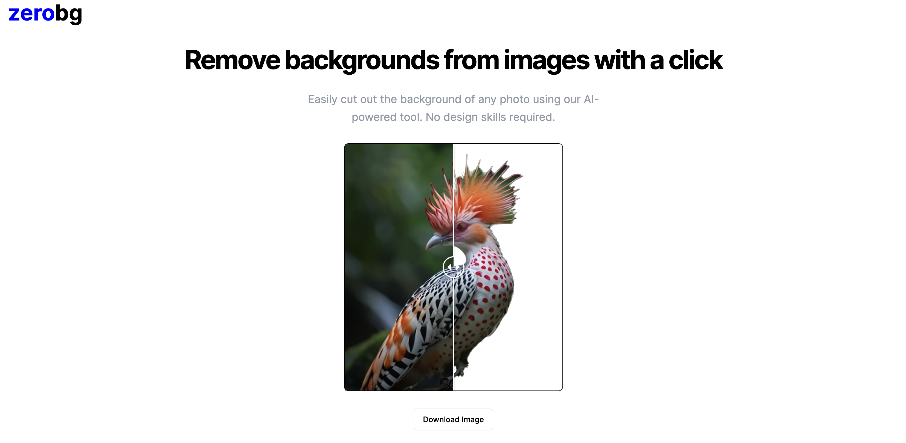

# ZeroBG

Remove the background from images using the power of AI!

## Table of contents

- [Overview](#overview)
  - [The challenge](#the-challenge)
  - [Links](#links)
  - [Screenshot](#screenshot)
- [My process](#my-process)
  - [Built with](#built-with)
  - [Useful resources](#useful-resources)
- [How to run the project locally](#install-project-locally)
- [Author](#author)
- [Acknowledgments](#acknowledgments)

## Overview

### The challenge

Users should be able to:

- Upload an image
- Remove the background from an image
- Download the processes images

Additional features:

- Error handling via toasts

### Links

- Live Demo: [https://zerobg.vercel.app/](https://zerobg.vercel.app/)

### Screenshot

## My process

### Built with

- TypeScript
- Next.js
- TailwindCSS
- Shadcn
- [Replicate AI](https://replicate.com/lucataco/remove-bg?input=nodejs) for background removal
- [React Dropzone](https://www.npmjs.com/package/react-dropzone) for drag and drop of images
- [File Saver](https://www.npmjs.com/package/file-saver) for image downloads
- [React Compare Image](https://www.npmjs.com/package/react-compare-image) for before and after image comparison
- [React Confetti Boom](https://www.npmjs.com/package/react-confetti-boom) for the success confetti
- Mobile-first workflow

### Useful resources

- [React dropzone tutorial](https://www.youtube.com/watch?v=8uChP5ivQ1Q)

### Install project locally

- Clone the repo
- Run `npm install`
- Sign up at [replicate.com](https://replicate.com/) to get an API key
- In the root of the project create a .env.local file
- Add the API key from replicate in the following format
  - `REPLICATE_API_TOKEN=enter_your_API_key_here`
- Run the project with `npm run dev`

## Author

- Portfolio - [aaronkagan.dev](https://www.aaronkagan.dev)
- Linkedin - [/aaron-kagan](https://www.linkedin.com/in/aaron-kagan/)
- X - [@aaronkagandev](https://www.twitter.com/aaronkagandev)
- Instagram - [aaronkagandev](https://www.instagram.com/aaronkagandev/)

## Acknowledgments

I want to thank [Vladimir Palacio](https://www.linkedin.com/in/vlachomir/) for all his help and guidance while building this project.
